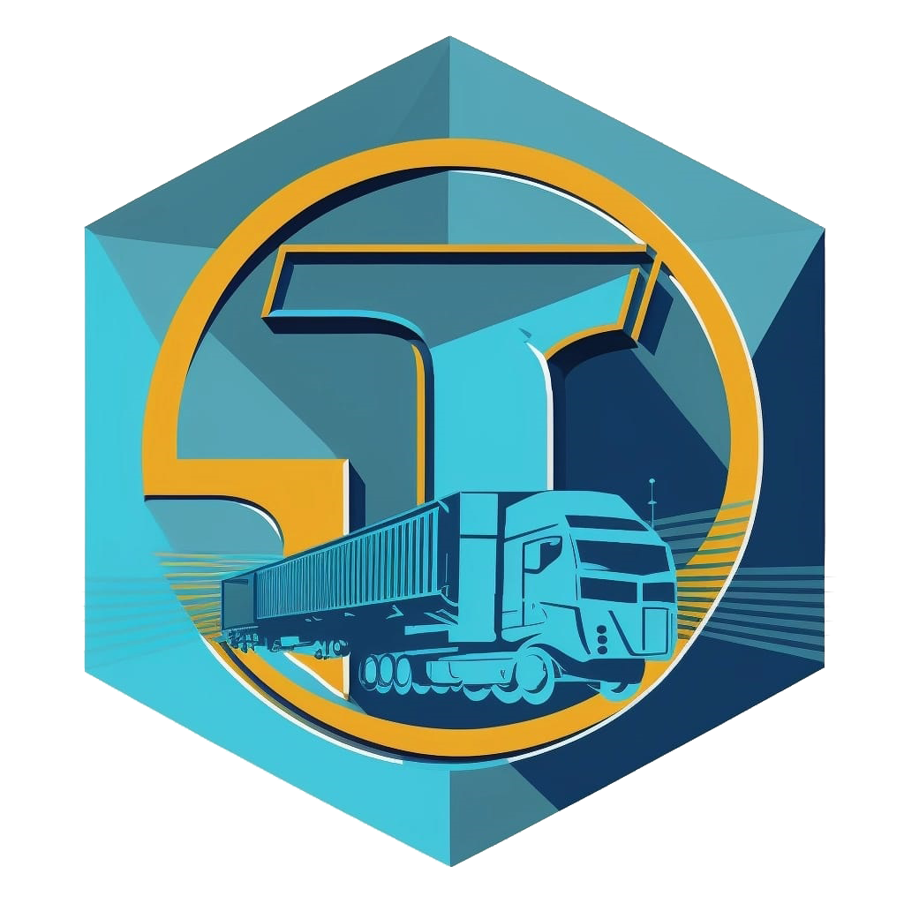

# TriumLogistics

  

Experiência sem fronteiras.

# Sumário

   * [Sobre](#TriumLogistics)
   * [Sumário](#sumário)
   * [Entregas](#entregas)
   * [Documentações](#documentações)
   * [Tecnologias](#tecnologias)
   * [Autores](#autores)

# Entregas

- [Sprint 1](https://github.com/marcelouchoas/Trium-Logistics/blob/Sprint-1/README.md) entrega realizada em 
- [Sprint 2]() entrega realizada em 
- [Sprint 3]() entrega realizada em 
- [Sprint 4]() entrega realizada em 

# Tecnologias

As seguintes ferramentas foram usadas na construção do projeto:

- [Pacote Office] (https://www.microsoft.com/pt-br/microsoft-365/free-office-online-for-the-web)
- [Earth] (https://www.google.com/earth/index.html)

# Autores

<table align="center">
  <tr>
     <td align="center"><a href="https://github.com/Gabriel-Martins-Gazaneo"> <b>Gabriel PO</b></a> <a href="https://github.com/marcelouchoas/Trium-Logistics" title="Master">:sparkles::iphone::open_book:</a></td>
    
    <td align="center"><a href="https://github.com/marcelouchoas"> <b>Marcelo Master</b></a> </td>

</table>
