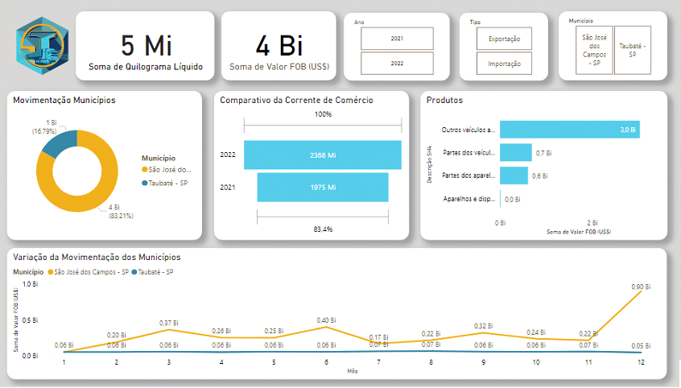
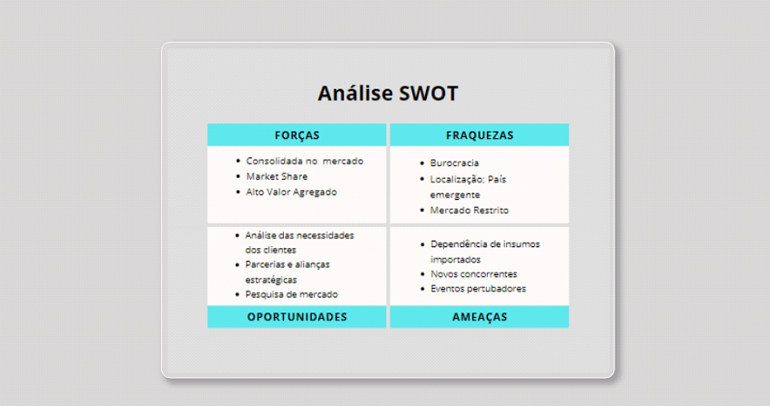

# Trium Logistics

  

Experiência sem fronteiras.

# Sumário
   * [Prduto](#produto)
   * [Entregas](#entregas)
   * [Tecnologias](#tecnologias)
   * [Autores](#autores)

# Produto
  Link para acessar ao produto
  
  https://app.powerbi.com/links/x_VrtJg5hk?ctid=cf72e2bd-7a2b-4783-bdeb-39d57b07f76f&pbi_source=linkShare
  
Na etapa inicial, foi realizado o download de quatro tabelas de fatos, em arquivos csv, dos anos de 2022 e 2021, divididas entre importações e exportações, a partir da base de dados do Comex Stat. Em seguida, foram adquiridas três tabelas de dimensões que caracterizavam países, municípios e produtos (SH4).  
  

  
  
Com base nisso, foram estabelecidas relações entre as tabelas, utilizando dados em comum, e em seguida foram aplicados filtros para obter informações apenas das cidades requeridas. Dessa forma, a base relacional foi utilizada, aproveitando as relações estabelecidas como filtros e trocando informações para representação dos dados. 

  

Em seguida, foram criados painéis com uma abordagem consistente, seguindo um storytelling e um padrão de organização da esquerda para a direita e de forma ascendente para descendente. Esses painéis apresentavam cartões com informações como valores em quilogramas líquidos e valor FOB, um filtro para selecionar cidades, países que mais importavam ou exportavam, tanto em quilogramas líquidos quanto em valor FOB, além dos produtos e a variação ao longo dos meses no período de janeiro de 2021 a dezembro de 2022. 

Nestas capturas de tela, são apresentadas as páginas do dashboard que ilustram os dados de exportação para os anos de 2021 e 2022. 

  

 

  

Adicionando também, capturas de tela que apresentam as páginas do dashboard que ilustram os dados de importação para os anos de 2021 e 2022. 

  

 

  
   
A diferença entre as páginas estava relacionada ao tipo de fato (exportação ou importação) e ao ano (2021 ou 2022), oferecendo diferentes perspectivas sobre os dados. 
   
# Tecnologias

As seguintes ferramentas foram usadas na construção do projeto:

- [Pacote Office] (https://www.microsoft.com/pt-br/microsoft-365/free-office-online-for-the-web)
- [Earth] (https://www.google.com/earth/index.html)
- [Jira Software] (https://www.atlassian.com/br/software/jira)
- [Power BI] (https://powerbi.microsoft.com/pt-br/)

# Autores

<table align="center">
  <tr>
     <td align="center"><a href="https://github.com/Gabriel-Martins-Gazaneo">         <b>Gabriel PO</b></a> </td>    
    <td align="center"><a href="https://github.com/marcelouchoas">         <b>Marcelo Master</b></a> </td>
    <td align="center"><a href="https://github.com/marciasoaresa">        <b>Márcia Scrum Team</b></a> </td>    
    <td align="center"><a href="https://github.com/rafaslivka">           <b>Rafael Scrum Team</b></a> </td> 
</table>
