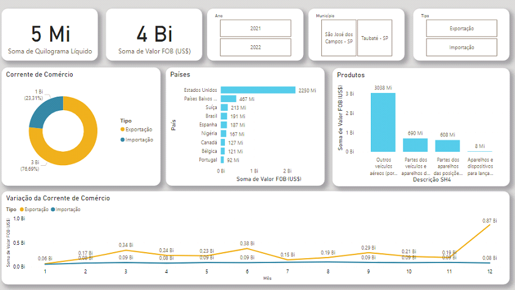
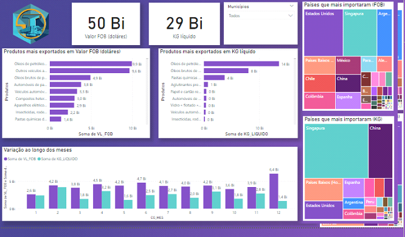

# Trium Logistics

  

Experiência sem fronteiras.

# Sumário

   * [Produto](#produto)
   * [Entrega](#entregas)
   * [Tecnologias](#tecnologias)
   * [Autores](#autores)
  
 # Produto
  
Foram solicitados os dados de importação e exportação da Região Metropolitana do Vale do Paraíba e Litoral Norte (RMVALE). Com base nessas informações, foi aplicado um filtro para destacar as principais cadeias produtivas e os principais produtos em termos de valor FOB. O objetivo final era criar um painel interativo utilizando o próprio Excel, no qual seriam representados os países que mais importam e exportam em relação à região, produtos e anos. Para isso, foram utilizados filtros que diferenciam os gráficos, proporcionando uma visualização mais clara e personalizada dos dados. 

A seguir estão os gráficos com seus respectivos filtros, que representam as variáveis mencionadas anteriormente. Cada ponto nos gráficos busca retratar informações que podem ser filtradas utilizando as tabelas localizadas ao lado. 

Neste gráfico, o foco está em identificar os países para os quais a região mais exporta, utilizando filtros de anos e países. 

  

Neste gráfico, o objetivo principal é visualizar os países que são os principais destinos das importações da região, utilizando filtros de anos e países para personalizar a análise. 
  

  
  
Neste gráfico, a intenção é examinar os produtos mais importados pela região, utilizando filtros de código e anos para uma análise mais detalhada e específica. 
  

  

Neste gráfico, o objetivo é analisar os produtos mais exportados pela região, utilizando filtros de código e anos para uma análise mais específica. 
  

  
  
# Entregas

- [Sprint 1](https://github.com/marcelouchoas/Trium-Logistics/blob/Sprint-1/README.md) entrega realizada em 03/04/2023.

# Tecnologias

As seguintes ferramentas foram usadas na construção do projeto:

- [Pacote Office] (https://www.microsoft.com/pt-br/microsoft-365/free-office-online-for-the-web)
- [Earth] (https://www.google.com/earth/index.html)
- [Jira Software] (https://www.atlassian.com/br/software/jira)

# Autores

<table align="center">
  <tr>
     <td align="center"><a href="https://github.com/Gabriel-Martins-Gazaneo">         <b>Gabriel PO</b></a> </td>    
    <td align="center"><a href="https://github.com/marcelouchoas">         <b>Marcelo Master</b></a> </td>
    <td align="center"><a href="https://github.com/marciasoaresa">        <b>Márcia Scrum Team</b></a> </td>    
    <td align="center"><a href="https://github.com/rafaslivka">           <b>Rafael Scrum Team</b></a> </td> 
</table>
